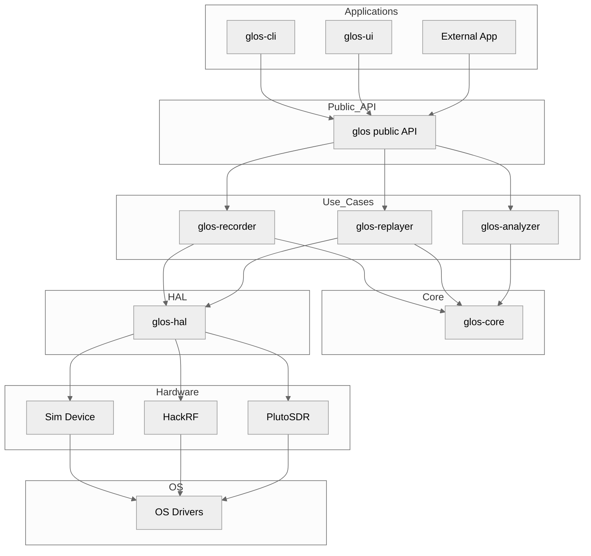
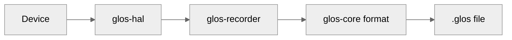
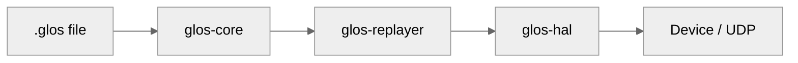

# GLOS — GLONASS Signal Recorder & Playback Tool


> ⚠️ **Project Status: Early Development (pre-0.1)**
>
> GLOS is currently under active development.
> Core components and the `.glos` file format are evolving and may change
> until the first stable release (v0.1).
>
> The current focus is building a reliable recording, replay and analysis
> core.

**GLOS** (GLONASS Signal Recorder & Playback) is a modular engineering
toolkit for recording, replaying and analysing GNSS RF and navigation data.
It is intended for engineers and researchers testing antennas, filters,
receivers, and navigation algorithms under controlled and reproducible
conditions.

## What is GLOS?

GLOS is infrastructure for GNSS experimentation focused on:

- recording RF/IQ GNSS signals,
- deterministic playback for testing,
- signal analysis and visualization,
- reproducible laboratory experiments.

The project is designed as a **set of reusable components**, not a monolithic
application.

## Table of Contents

- [Goals](#goals)
- [Design Principles](#design-principles)
- [Why it matters](#why-it-matters)
- [Key features](#key-features)
- [Architecture](#architecture)
- [Repository layout](#repository-layout)
- [Quick start](#quick-start)
- [Testing](#testing)
- [Recorder Usage](#recorder-usage)
- [.glos file format](#glos-file-format-short)
- [Integration](#integration)
- [Project Maturity](#project-maturity)
- [Safety & legal notes](#safety--legal-notes)
- [Contributing](#contributing)
- [Roadmap & extensions](#roadmap--extensions)
- [Versioning](#versioning)
- [License](#license)

## Goals

Create a universal tool for GNSS engineers and researchers that can:

- Record real GNSS signals (IQ or navigation data) from SDRs or receivers.
- Replay recorded signals in laboratory environments.
- Analyse signals (spectrum, SNR/CN0, Doppler, decoded frames).
- Visualise data in real time via GUI or CLI.

## Design Principles

GLOS follows several engineering principles:

- **Reproducibility first** — experiments must be replayable.
- **Deterministic formats** — recordings are versioned and verifiable.
- **Modular architecture** — independent reusable crates.
- **Hardware-agnostic design** — SDR backends are interchangeable.
- **Safety awareness** — RF replay must remain controlled and lawful.

## Why it matters

GLOS fills an important niche in the GNSS engineering ecosystem by
providing an open and reproducible environment for signal capture
and replay experiments.

Typical use cases include:

- R&D and lab validation of signal-processing algorithms.
- Receiver and antenna testing (PLL, filters).
- Reproducing spoofing or fault scenarios in controlled environments.
- Education and reproducible experiments.

## Key features

- Portable and high-performance core written in Rust.
- Structured, versioned real-time format for IQ + metadata (binary,
  CRC-protected).
- Recorder component supporting SDRs and hardware receivers.
- Replayer capable of UDP/Ethernet replay (future RF replay with dedicated
  hardware).
- Analyzer tools: FFT, waterfall, SNR/CN0 extraction, Doppler statistics.
- Optional GUI visualisation (egui / Tauri backends).
- Integration points for telemetry and integrity analysis pipelines.

## Architecture (high level)

Simple conceptual flow:

```
[ SDR / GNSS Receiver ]
        ↓
[ glos-recorder ] ──►     session.glos  (IQ + metadata)
        ↓
[ storage / archive ]
        ↓
[ glos-replayer ] ◄───►   UDP / Lab RF
        ↓
[ glos-analyzer / UI ]
```

Core components are split into reusable crates:

- **glos-core** — file format & low-level IQ handling
- **glos-recorder** — acquisition and recording
- **glos-replayer** — replay engine
- **glos-analyzer** — DSP and analysis tools
- **glos-ui** — visualization (optional)
- **glos-hal** — hardware abstraction layer for SDR devices
- **glos** — (optional) public API / facade crate for high-level clients

## Repository layout

```
glos
├── glos-analyzer
├── glos-cli
├── glos-core
├── glos-hal
├── glos-recorder
├── glos-replayer
├── glos-types
└── glos-ui
```

## Architecture Overview



## Recorder (detailed flow)



## Replayer (detailed flow)



## Quick start

> Prerequisites: Rust (stable toolchain).
> Optional SDR backends: SoapySDR / RTL-SDR / PlutoSDR / USRP.

Build workspace:

```zsh
cargo build --workspace --release
```

Run tests:

```zsh
cargo test --workspace
```

## Testing

### Run all workspace tests

```zsh
cargo test --workspace
```

### Test only `glos-core`

```zsh
cargo test -p glos-core
```

### Test only `glos-recorder`

```zsh
cargo test -p glos-recorder
```

### Tests with logs enabled

```zsh
RUST_LOG=info cargo test -p glos-recorder -- --nocapture
```

### glos-core integration tests

```zsh
cargo test -p glos-core --test integration_tests
```

## Recorder Usage

### Simulator mode (no hardware)

```zsh
cargo run -p glos-recorder --release -- \
  --device sim \
  --freq 1602MHz \
  --rate 2MHz \
  --gain 40 \
  --output signal.glos \
  --duration 5
```

### Simulator with LZ4 compression

```zsh
cargo run -p glos-recorder --release -- \
  --device sim \
  --freq 433MHz \
  --rate 2MHz \
  --compress lz4 \
  --output signal_lz4.glos \
  --duration 10
```

## Replayer Usage

See [link](./docs/QUICK_START.md)

### HackRF One recording

Requirements:

- `--features hackrf`
- system package `libhackrf-dev`

```zsh
sudo apt install libhackrf-dev
```

Run:

```zsh
cargo run -p glos-recorder --release --features hackrf -- \
  --device hackrf \
  --freq 1602MHz \
  --rate 2MHz \
  --gain 40 \
  --output hackrf.glos \
  --duration 60
```

### Validate recorded file

```zsh
cargo run -p glos-core --example read_glos_file -- signal.glos
cargo run -p glos-core --example read_glos_file -- signal_lz4.glos
```

## .glos file format (short)

GLOS uses a compact binary container:

- 128-byte fixed header (magic, version, sample rate, center frequency,
  CRC)
- Time-stamped IQ blocks
- Optional LZ4 compression
- Metadata describing SDR configuration and session timing

See **glos-core** for the canonical implementation and tests.

## Integration

GLOS is the first component of a larger GNSS experimentation ecosystem.

Future companion projects:

- **GLINT** — signal integrity analysis and anomaly detection
- **USMET** — telemetry storage, aggregation and visualization

Planned workflow:

```
GLOS (signal capture)
          ↓
GLINT (analysis & detection)
          ↓
USMET (storage & visualization)
```

Each project is developed independently and released separately.
GLOS remains fully usable as a standalone recording and replay tool.

## Project Maturity

| Component   | Status                |
| ----------- | --------------------- |
| glos-core   | 🟡 active development |
| file format | 🟡 stabilizing        |
| recorder    | 🟡 prototype          |
| replayer    | 🟡 prototype          |
| analyzer    | 🔴 early stage        |
| UI          | 🔴 experimental       |

## Safety & legal notes

Replaying RF signals (including GNSS) may interfere with real navigation
systems and can be illegal in many jurisdictions.

Always:

- Use shielded environments or RF enclosures.
- Prefer network replay in laboratory setups.
- Verify local spectrum regulations.
- Never transmit over public wireless infrastructure.

## Contributing

Contributions are welcome.

Suggested workflow:

1. Fork and create a feature branch.
2. Keep changes small and tested.
3. Add tests and update documentation.
4. Open a PR describing motivation and design.

See `CONTRIBUTING.md` for details.

## Roadmap & Extensions

Planned directions:

- Support for GPS / Galileo / BeiDou.
- Hardware-gated RF replay.
- Extended metadata (IMU, antenna models).
- Live streaming mode.
- Integration testing pipelines.

## Versioning

Until **v0.1**:

- breaking changes are expected,
- APIs may change,
- file format is not yet stable.

Semantic Versioning will be adopted starting from v0.1.

## License

See. [LICENSE](./LICENSE)
